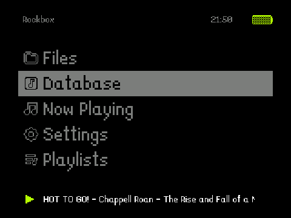
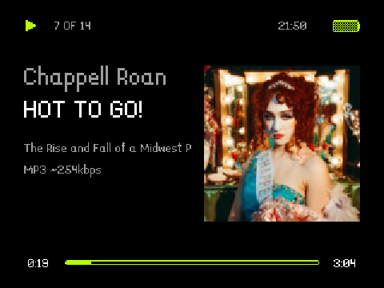
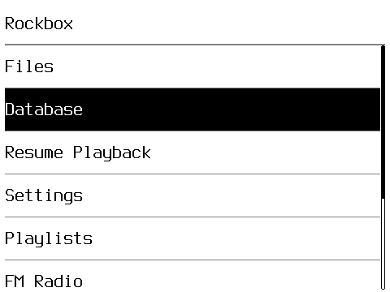
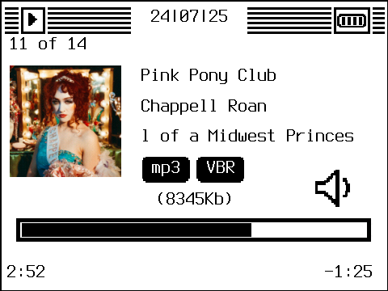

# Rockbox Android Fork for Innioasis Y1

|  |  |
|:--:|:--:|
| Rockbox 240p - Menu | Rockbox 240p - WPS |

|  |  |
|:--:|:--:|
| Rockbox 360p - Menu | Rockbox 360p - WPS |

## General Information

This is an experimental build of Rockbox.

Most of the work was already done by the original Rockbox team - all credits to them. Also, thank you to [Chainfire/libsuperuser](https://github.com/Chainfire/libsuperuser) for providing a library that enables easy execution of root commands.

I mostly added quick hacks to make this usable on a device without any touch inputs.

Do NOT run this if you don't know what you are doing. You might brick your device in the process of installing this app. You have been warned.

## 240p vs 360p Releases

The Innioasis Y1 has a 480x360px screen. Most Rockbox themes were developed for devices with a resolution of 320x240px screens. Those themes usually do not work on a 360p Rockbox Android build.

Therefore there are 2 versions of this Rockbox port:

### 360p Rockbox
**Pros**:

- crisp high-resolution and minimalist Rockbox experience
- included, ready to go, Light and Dark Theme (modified versions of MacClassic https://themes.rockbox.org/index.php?themeid=3104)

**Cons**:

- Themes built for other devices usually don't work

### 240p Rockbox
**Pros**:

- huge themes backlog (roughly 2/3 of themes here seem to work: https://themes.rockbox.org/index.php?target=ipod6g)

**Cons**:

- lower resolution (1/3 smaller than 360p - images might be blurry, fonts can look a bit off)

## Installation
### Y1 Helper (recommended for Windows)

Install the most recent release of the Y1 Helper application and follow the instructions to install Rockbox: https://github.com/team-slide/Y1-helper/releases/latest

### SPFlash Tool (recommended for Linux)

1. Download the latest Rockbox included firmware here (the RAR archive, not the ZIP): https://github.com/team-slide/project-gallagher/releases/latest
2. Unpack the archive
3. Install SP Flash Tool v5.1904:
  - Windows: included in the archive, alternatively: https://spflashtools.com/windows/sp-flash-tool-v5-1904
  - Linux: https://spflashtools.com/linux/sp-flash-tool-v5-1904-for-linux
4. Start SP Flash Tool
5. Follow the official firmware flashing instructions but use the MT6572_Android_scatter.txt from the Project Gallagher archive

### Manual installation (for developers)

If, despite all warnings, you still want to try installing it manually you need to do the following:

- have an Innioasis Y1 with ADB enabled
- root the device (see https://xdaforums.com/t/root-framaroot-a-one-click-apk-to-root-some-devices.2130276/):
```
adb install Framaroot-1.9.3.apk
adb shell monkey -p com.alephzain.framaroot -c android.intent.category.LAUNCHER 1
# wait for it to start
adb shell input DPAD_DOWN
adb shell input DPAD_CENTER
# wait for the success message
```
- Reboot device
```
adb reboot
```
- Update keymap file to be able to navigate systems menus
```
adb shell mount -o rw,remount /system
adb pull /system/usr/keylayout/Generic.kl Generic.kl
cp Generic.kl Generic.kl_backup
sed -i '/key 103   DPAD_UP/c\key 105   DPAD_UP' Generic.kl
sed -i '/key 108   DPAD_DOWN/c\key 106   DPAD_DOWN' Generic.kl
sed -i '/key 105   DPAD_LEFT/c\key 103   MEDIA_PREVIOUS' Generic.kl
sed -i '/key 106   DPAD_RIGHT/c\key 108   MEDIA_NEXT' Generic.kl
sed -i '/key 163   MEDIA_NEXT/c\key 163   DPAD_RIGHT' Generic.kl
sed -i '/key 165   MEDIA_NEXT/c\key 165   DPAD_LEFT' Generic.kl
adb push Generic.kl /system/usr/keylayout/Generic.kl
adb shell chmod 644 /system/usr/keylayout/Generic.kl
adb reboot
```
- Download the latest Rockbox release APK from the sidebar
```
adb install rockbox-[240p/360p]-[release].apk
```
- Either use one of the preinstalled themes or supply your own in the .rockbox folder on the SD card
- Uninstall any apps you do not want
```
# list packages
adb shell pm list packages
# uninstall package
adb uninstall <package>
# or if that fails
adb shell pm disable-user <package>
```
- Restart the device, choose Rockbox as launcher when asked
```
adb reboot
```

**First start might take up to 10s or even display an error about reading the SD card:**

- That's not a problem and should only happen once
- Restart Rockbox when in doubt via `Main Menu > System > Restart Rockbox (last option in list)`

## Controls

- Scroll Wheel (Most Screens): Up / Down
- Scroll Wheel (Now Playing screen): Volume
- Center (Short): Accept / Enter
- Center (Long): Turn Off Screen
- Menu/Back: Cancel / Back
- Media Buttons: Media Actions

## Themes (240p)

### Installation

1. (optional) Download the fontpack, extract it, drag the .rockbox folder onto your device https://www.rockbox.org/dl.cgi?bin=fonts
2. Download a theme from https://themes.rockbox.org/index.php?target=ipod6g
3. extract it
4. drag the .rockbox folder onto your device

### List of working Themes

There are likely more but these are tested.

- CenterArt
- FreshOSInstall (needs manual steps)
- Horizon
- iLike
- OneBit_OLED
- OneBit_Mono
- OneBit_VFD_ALT
- OP_1
- Orbit
- SKIDMARK (artefacting in menus)
- SNAZZ2 (artefacting in menus)
- SNAZZ3 (artefacting in menus)
- InfoMatrix
- naranjada
- PodOne
- Redux
- Themify
- Win95
- xplorr

## How to restart the app

When you initialize the database Rockbox will ask you to restart. You can do this via `Main Menu > System > Restart Rockbox (last option in list)`.

## Changes vs. upstream Rockbox

- Remapped controls
- Enable seek forward/backward by holding next/previous media keys
- Change default theme to an adjusted version of MacClassic https://themes.rockbox.org/index.php?themeid=3104
- Dark theme variant of MacClassic
- Playlist creation without keyboard
- Option to copy playlists found on the device to the playlist menu (Settings > Database > Copy Playlists on Scan)
- Display brightness settings (Settings > Brightness)
- Disable broken menu items
- External app launcher
- Haptic scroll wheel vibration (Settings > Wheel Vibration Intensity)
- Menu item to restart the Rockbox app (for easier DB updates)
- Menu item to launch android bluetooth and systems menu
- Menu item to launch FM radio
- Hold center button to turn screen off
- Menu item to shutdown device

## Known issues

- Setting different theme might need a restart of Rockbox (Main Menu > System > Restart Rockbox) or clearing the backdrop (Theme Settings)
- Rockbox might randomly crash (usually recovers on its own now) - restart your device or Rockbox via:
```
adb shell monkey -p org.rockbox -c android.intent.category.LAUNCHER 1
```

## Planned

Ordered by priority

### Unknown/Long-term
#### Settings Menus

- Screen timeout
- Wifi (not enabled in current ROMs)

#### Connectivity

- Fetch podcasts via rss (dependent on wifi)
